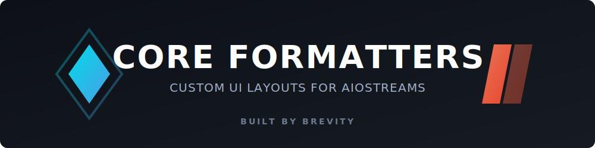
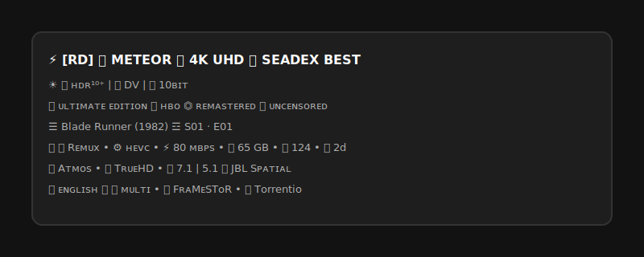
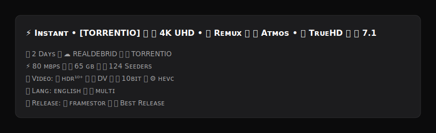
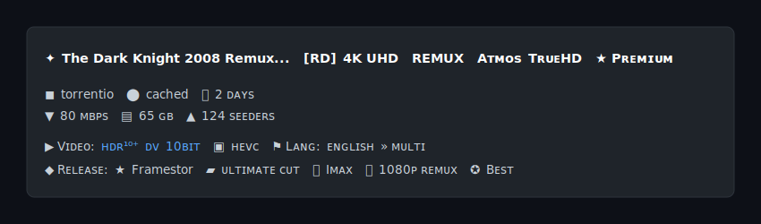
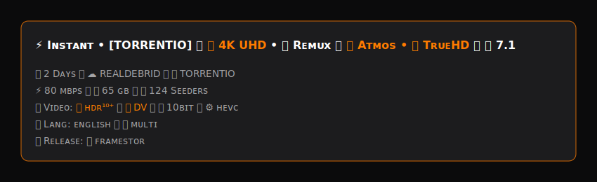

<p align="center">
  
</p>

# 🎨 Core Visual Formatters

Beyond just filtering streams, **Core Builds** includes custom UI formatters for AIOStreams. These formatters completely overhaul how your cached links are displayed inside Stremio and WuPlay, making it instantly clear what resolution, codec, and audio track you are selecting.

No more squinting at raw file names. Just clean, colour-coded badging.

---

## 🌌 Omni Diamond Hybrid (v2.2.0)
**The Ultimate Metadata Tracker**

The newest flagship layout. This formatter marries the incredibly detailed metadata tracking of the Omni format with the clean `smallcaps` and emoji styling of the Zenith Diamond structure.



**Key Features:**
* Advanced tags for Editions (IMAX, Director's Cut), Networks (HBO, Netflix), and Repacks.
* Smart Usenet Failover visually supported (⚡ for Instant Cached BitTorrent, ⏳ for Uncached NZBgeek downloads).
* Highly detailed audio, bitrate, and language tracking without breaking the layout.

---

## 💎 Core Zenith Diamond
**The Premium, High-Contrast Layout**

Designed for maximum readability from the couch. The Zenith Diamond formatter uses a sleek, high-contrast badging system that prioritises resolution (4K/1080p) and visual formats (DV/HDR10+) so you know exactly what your hardware is about to decode.



**Key Features:**
* Highlighted Remux and BluRay tags.
* Distinct badging for Dolby Vision vs. standard HDR.
* Clean, minimalist spacing to reduce UI clutter.

---

## 🌙 Midnight Slate
**The Dark, Geometric Layout**

A formatter built around a dark slate aesthetic. Geometric symbols replace emoji badges for a cleaner, more understated look. Designed to feel native to dark-theme setups without sacrificing information density.



**Key Features:**
* `✦` / `✧` cached indicators — instantly readable at a glance.
* Lowercase metadata throughout — no smallcaps, no clutter.
* Geometric symbols (`◼ ⬤ ⧗`) for addon, type, and age.
* Perfectly suited for OLED displays and dark-first setups.

---

## 🐅 Auburn Tiger Edition
**The Bold, Thematic Layout**

Built for those who want a stylized, aggressive look to their stream lists. The Auburn Tiger Edition utilises a custom colour palette to make the absolute best cached links jump off the screen.



**Key Features:**
* Bold, thematic colour coding for quick scanning.
* Prioritised high-end audio tags (Atmos, TrueHD, DTS:X) with prominent highlights.
* Stripped-down metadata for a punchier, faster-reading list.

---

## ⚙️ How to Apply a Formatter

1. Copy the **raw URL** of your chosen formatter from the list below
2. In your AIOStreams dashboard, go to the **Formatter** section
3. Tap the **Import/Export icon** (bottom right — box with inward arrow)
4. Select **Import from File** and choose your downloaded `.json`
5. Click **Save** and refresh Stremio or WuPlay

**Raw download URLs:**

```
https://raw.githubusercontent.com/Branding-Brevity/Core-Builds-By-Brevity/refs/heads/main/Formatters/Core_Zenith_Diamond.json
```
```
https://raw.githubusercontent.com/Branding-Brevity/Core-Builds-By-Brevity/refs/heads/main/Formatters/Midnight_Slate.json
```
```
https://raw.githubusercontent.com/Branding-Brevity/Core-Builds-By-Brevity/refs/heads/main/Formatters/Core_Clean_Stream.json
```

> ⚠️ **Always use the raw URL — do not copy from the GitHub rendered page.** The GitHub file view adds hidden characters that cause a "Failed to parse JSON" error on import.

---

*Formatters designed by Brevity · [Full Formatter Guide](../Guides/FORMATTER_GUIDE.md)*
