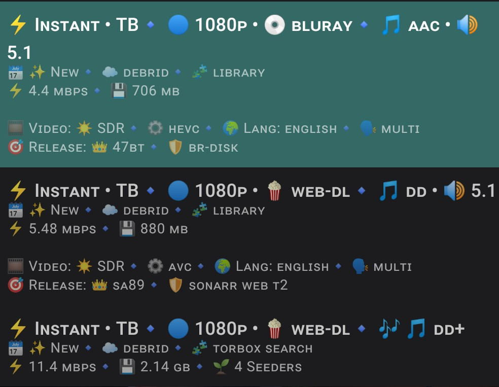
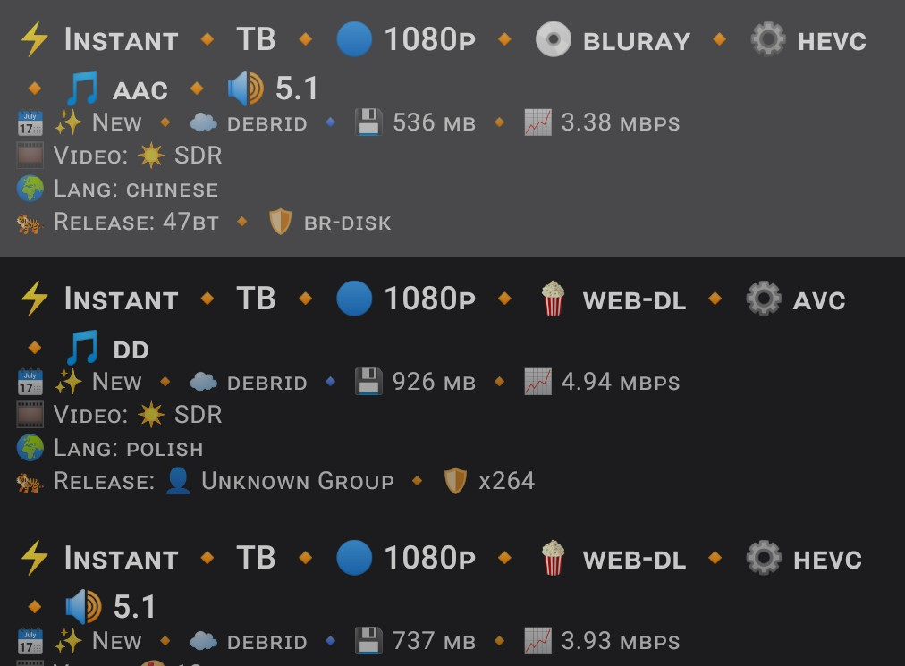

# 📸 Core Builds Visual Gallery

Get a look at the Core Builds and custom UI formatters in action. These layouts are designed to completely overhaul the Stremio and WuPlay experience, bringing premium, readable metadata straight to your TV.

---

## 💎 Core Zenith Diamond Formatter
*High-contrast, sleek badging prioritizing resolution, Dolby Vision, and HDR10+.*

*(Note: Clean, minimalist spacing reduces UI clutter on large 4K displays.)*

---

## 🐅 Auburn Tiger Edition Formatter
*Bold, aggressive color coding designed to highlight high-end surround sound audio tracks (Atmos, TrueHD, DTS:X).*

*(Note: Stripped-down metadata for punchier, faster-reading lists.)*

---

## ⚙️ The Core Builds in AIOStreams
*A look under the hood at the deeply optimized deduplication and caching configurations powering the Core Builds.*

---

### Want to submit your own setup?
If you've got a great shot of the Core Builds running on your home theater or WuPlay setup, feel free to submit an issue with the screenshot, and we might feature it here!

---
*Return to the [Main README](./README.md).*
