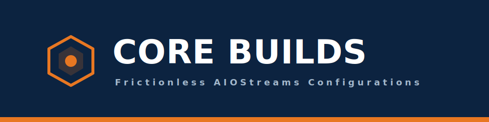

  

# 🛡️ Core Builds by Brevity

Welcome to **Core Builds**. This repository hosts highly optimized, frictionless configuration templates and custom formatters for **AIOStreams**, specifically tuned for seamless playback on WuPlay, Stremio, and Android-based home theater setups.

## 🎯 The Philosophy
Streaming shouldn't involve trial and error. These builds are engineered to strip out unplayable clutter, prevent network choking, and serve only the highest quality compatible files. Every build features aggressive deduplication, smart caching, and prioritizes English/Dual-Audio tracks natively.

---

## 🚀 The Flagship Builds

### 📦 Single Service (TorBox Exclusive)
*Optimized for a pure, high-speed TorBox and Usenet experience.*

* **[Core Nexus 1080p SDR](./Templates/Single-Service/core-nexus-torbox-exclusive_rpdb.json):** Built for Android projectors and Google TV. Blocks 4K, AV1, DV, and heavy lossless audio.
* **[Core Nexus 4K Home Theater](./Templates/Single-Service/core-nexus-4k-ht-torbox.json):** The unleashed edition. Hunts for 4K Remuxes, Dolby Vision, and HDR10+.

### ⛓️ Dual Service (Dual Core Hybrid)
*For power users running TorBox + Real-Debrid. Features cross-service failover and massive library depth.* *(Note: We have implemented custom filtering in these templates to help mitigate the recent Real-Debrid "infringing file" playback issues.)*

* **[Dual Core 1080p SDR](./Templates/Dual-Service/core-nexus-dual-core-1080p.json):** Frictionless 1080p locking with dual-cache merging.
* **[Dual Core 4K Unleashed](./Templates/Dual-Service/core-nexus-dual-core-4k.json):** The ultimate master build. Combines TorBox Usenet priority with the massive Real-Debrid cache.

---

## 📂 Repository Structure

### [`/Templates`](./Templates)
Raw JSON configuration files organized into **Single-Service** and **Dual-Service** subfolders.

### [`/Formatters`](./Formatters)
Custom visual layouts for the AIOStreams UI featuring the **Core Zenith Diamond** and **Auburn Tiger** badging system.

### [`/Community-Builds`](./Community-Builds)
A collection of experimental layouts and community-driven templates offering alternative aesthetics outside of the core WuPlay design language.

### [`/Guides`](./Guides)
Step-by-step setup guides explaining how to import these templates and link your manifest to WuPlay.

---

## 🤝 Community Templates & Non-Core Builds

While the **Core Nexus** builds represent our official, heavily tested configurations, we also host a collection of experimental layouts and community-driven templates. These builds offer different aesthetics and use-cases outside of the primary WuPlay design language.

| Template Name | Vibe / Style | View Build |
| :--- | :--- | :--- |
| **Auburn Tiger Edition (by RB3)** | Warm / Aggressive | [View JSON](./Community-Builds/auburn-tiger-rb3.json) |

> **⚠️ Note on Community Templates:** > These files are not subject to the same strict character-limit and UI-breaking tests as the Core Nexus Masterfiles. Use them freely, but expect occasional formatting quirks depending on your scraper results.

### Want to contribute?
If you've built a killer AIOStreams formatter using our core logic, open a Pull Request and submit your `.json` file to the `Community-Builds/` folder!

---

## ⚙️ Quick Start: How to Import

1.  Navigate to your preferred AIOStreams host (e.g., [ForTheWeak](https://aiostreams.fortheweak.cloud/)).
2.  Go to the **Template Import** menu.
3.  Copy the **Raw Link** for your chosen build and paste it into the importer:
    * [1080p Single - Raw Link](https://raw.githubusercontent.com/Branding-Brevity/Core-Builds-By-Brevity/main/Templates/Single-Service/core-nexus-torbox-exclusive_rpdb.json)
    * [4K Single - Raw Link](https://raw.githubusercontent.com/Branding-Brevity/Core-Builds-By-Brevity/main/Templates/Single-Service/core-nexus-4k-ht-torbox.json)
    * [1080p Dual Core - Raw Link](https://raw.githubusercontent.com/Branding-Brevity/Core-Builds-By-Brevity/main/Templates/Dual-Service/core-nexus-dual-core-1080p.json)
    * [4K Dual Core - Raw Link](https://raw.githubusercontent.com/Branding-Brevity/Core-Builds-By-Brevity/main/Templates/Dual-Service/core-nexus-dual-core-4k.json)
4.  Follow the setup instructions in the [`/Guides`](./Guides) folder.

---

## ☕ Support the Project
If these templates have leveled up your home theater or Stremio setup and saved you from buffering headaches, consider buying me a coffee. Your support fuels the late-night testing and continuous updates!

---
*Built and maintained by Brevity.*
